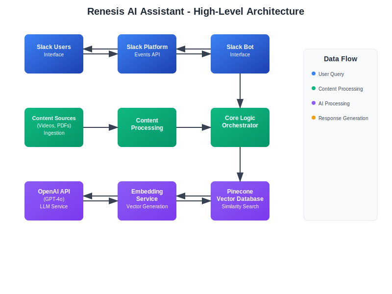

# System Architecture

This document provides a comprehensive overview of the Renesis AI Assistant's architecture, including system components, data flow, and integration patterns.

## High-Level Architecture



The Renesis AI Assistant follows a modular, event-driven architecture that processes user queries through multiple specialized layers. The system integrates Slack for user interaction, OpenAI for language processing, and Pinecone for vector-based content retrieval.

## Core Components

### 1. Slack Bot Interface (`src/bot.py`)

**Purpose**: Handles all Slack-related communications and user interactions.

**Responsibilities**:
- Receive messages from Slack Events API
- Parse user queries and extract intent
- Format and send responses back to Slack
- Handle different message types (mentions, DMs, etc.)
- Manage conversation context

**Key Technologies**:
- Slack Bolt SDK for Python
- Socket Mode for development
- Slack Web API for sending messages

**Integration Points**:
- Receives events from Slack Platform
- Sends queries to Core Logic module
- Formats responses for Slack display

### 2. Core Logic Orchestrator (`src/core_logic.py`)

**Purpose**: Central coordinator that manages the query-to-answer pipeline.

**Responsibilities**:
- Process incoming user queries
- Coordinate between different services
- Implement the main business logic flow
- Handle error scenarios and fallbacks
- Manage response assembly

**Process Flow**:
1. Receive query from Slack Bot
2. Preprocess and clean the query
3. Generate query embedding
4. Search for relevant content
5. Assemble context from search results
6. Generate answer using LLM
7. Format response with source references
8. Return structured response

### 3. Content Ingestion Pipeline (`src/content_ingestion/`)

**Purpose**: Processes raw content into searchable, embedded chunks.

**Components**:

#### 3.1 Transcription Service (`transcribe.py`)
- Converts audio/video to text using Whisper or AssemblyAI
- Handles multiple audio formats
- Preserves timestamp information
- Cleans and segments transcripts

#### 3.2 PDF Parser (`pdf_parser.py`)
- Extracts text from PDF documents
- Preserves document structure
- Handles images and tables
- Maintains page and section references

#### 3.3 Content Processor (`ingest.py`)
- Chunks content into manageable segments
- Adds metadata (source, timestamps, type)
- Generates embeddings for each chunk
- Stores processed content in vector database

### 4. Embedding Service (`src/embedding_service.py`)

**Purpose**: Generates vector embeddings for text content and queries.

**Responsibilities**:
- Generate embeddings using OpenAI's text-embedding-ada-002
- Handle batch processing for efficiency
- Manage embedding cache for performance
- Normalize embeddings for consistent search

**Features**:
- Batch processing for multiple texts
- Error handling and retry logic
- Embedding dimension: 1536
- Cosine similarity optimization

### 5. Pinecone Service (`src/pinecone_service.py`)

**Purpose**: Manages vector database operations for content storage and retrieval.

**Responsibilities**:
- Store content embeddings with metadata
- Perform similarity searches
- Manage index operations
- Handle batch upserts and queries

**Index Schema**:
```json
{
  "id": "unique_chunk_identifier",
  "values": [1536-dimensional vector],
  "metadata": {
    "source": "video_name_or_pdf_name",
    "content_type": "transcript|pdf",
    "timestamp_start": "00:05:30",
    "timestamp_end": "00:07:45",
    "chunk_index": 0,
    "text": "original_text_content",
    "page_number": 3,
    "section": "Introduction"
  }
}
```

### 6. Configuration Management (`config/settings.py`)

**Purpose**: Centralized configuration management for all services.

**Features**:
- Environment-based configuration
- Validation of required settings
- Type conversion and defaults
- Security best practices

### 7. Utilities (`src/utils/`)

**Purpose**: Shared utilities and helper functions.

**Components**:
- Logging configuration
- Error handling utilities
- Text processing helpers
- Validation functions

## Data Flow

### Content Ingestion Flow


The content ingestion pipeline transforms raw materials into searchable, embedded content through a systematic five-step process that preserves context and enables efficient retrieval.

### Query Processing Flow


The query processing pipeline handles user requests through a nine-step process, from initial Slack input to final response delivery, with typical response times of 3-6 seconds depending on query complexity.

## Integration Patterns

### External Service Integration

#### OpenAI API
- **Embeddings**: text-embedding-ada-002 model
- **Chat Completion**: GPT-4o model
- **Rate Limiting**: Implemented with exponential backoff
- **Error Handling**: Retry logic with circuit breaker pattern

#### Pinecone Vector Database
- **Connection**: Persistent connection with connection pooling
- **Indexing**: Batch upserts for efficiency
- **Querying**: Optimized similarity search with metadata filtering
- **Monitoring**: Health checks and performance metrics

#### Slack Platform
- **Events API**: Real-time message processing
- **Web API**: Response delivery
- **Socket Mode**: Development-friendly real-time connection
- **Rate Limiting**: Respect Slack's rate limits

### Internal Communication

#### Service Layer Pattern
- Each major component is a service with defined interfaces
- Dependency injection for testability
- Clear separation of concerns
- Error propagation and handling

#### Event-Driven Architecture
- Asynchronous processing where possible
- Event logging for debugging and monitoring
- Graceful degradation on service failures

## Security Architecture

### API Key Management
- Environment variable storage
- No hardcoded secrets
- Rotation capability
- Secure transmission (HTTPS/TLS)

### Data Protection
- Encryption in transit (HTTPS/TLS)
- Encryption at rest (Pinecone)
- Minimal data retention
- No PII storage

### Access Control
- Slack workspace-based access
- Bot permission scoping
- Rate limiting per user
- Input validation and sanitization

## Scalability Considerations

### Horizontal Scaling
- Stateless service design
- Load balancer compatibility
- Database connection pooling
- Caching strategies

### Performance Optimization
- Embedding caching
- Batch processing
- Asynchronous operations
- Connection reuse

### Monitoring & Observability
- Structured logging
- Performance metrics
- Error tracking
- Health checks

## Deployment Architecture


The deployment architecture supports both development and production environments with different scaling and security considerations. Development uses local execution with Socket Mode, while production employs containerized deployment with load balancing and auto-scaling capabilities.

## Technology Stack Summary

| Component | Technology | Purpose |
|-----------|------------|----------|
| Backend | Python 3.8+ | Core application logic |
| Slack Integration | Slack Bolt SDK | Bot interface |
| Vector Database | Pinecone | Similarity search |
| LLM | OpenAI GPT-4o | Answer generation |
| Embeddings | OpenAI text-embedding-ada-002 | Vector generation |
| Transcription | Whisper/AssemblyAI | Audio to text |
| PDF Processing | PyMuPDF | Document parsing |
| Configuration | python-dotenv | Environment management |
| Logging | Python logging | Observability |

## Next Steps

- [API Reference](api-reference.md)